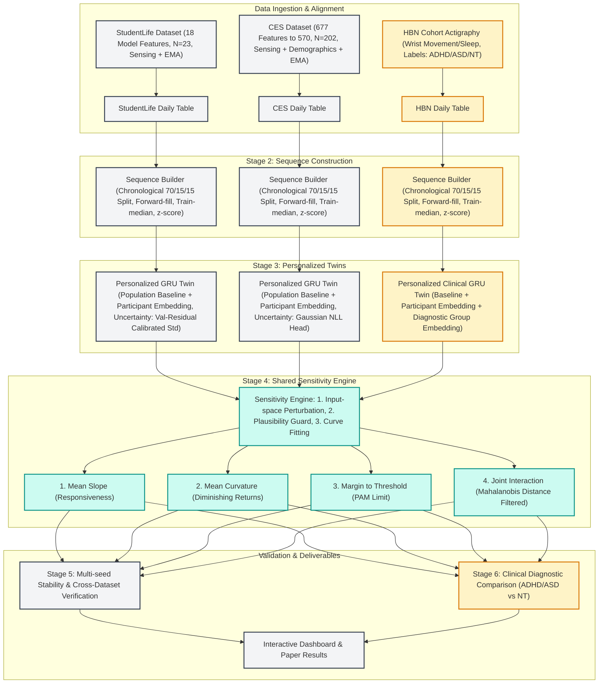
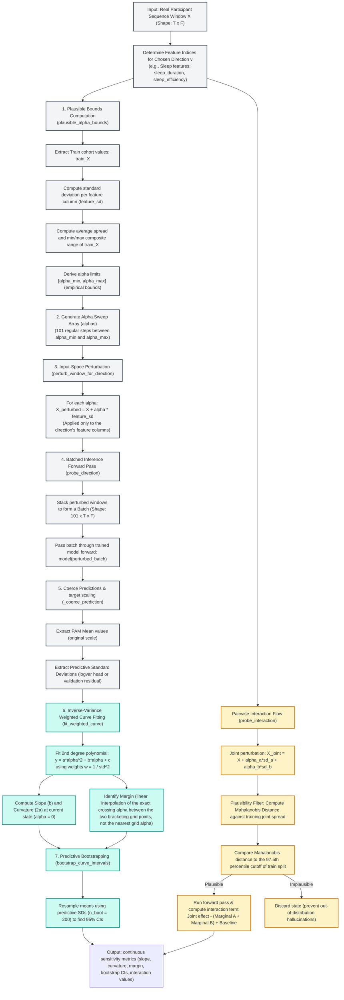

# PersonaTwin: Methodology & Presentation Guide
*A comprehensive guide for explaining the PersonaTwin research project, from foundational pipeline stages to advanced sensitivity-profiling and clinical diagnostic adaptations.*

---

> **Implementation status (read before presenting this guide to anyone):**
>
> - The current validated CES primary analysis uses a delta-PAM target with
>   1,982 train, 206 validation, and 212 test windows. The frozen primary
>   model is a 50-feature train-only selected Lasso; a bounded Gradient
>   Boosting model is retained as a secondary comparison. The older GRU and
>   3,599-window sensitivity outputs below are historical snapshots.
> - Two real bugs found and fixed since this guide's numbers were written:
>   (1) the personalized model's participant embedding wasn't being passed
>   through at all in the univariate path, and was being passed the wrong
>   (unmapped) index in the interaction path; (2) margin was quantized to
>   the nearest of 21 fixed alpha-grid points, which collapsed to identical
>   values across many windows (most visibly on `sleep`). Margin is now
>   computed via linear interpolation between grid points on a 101-point
>   grid, giving a continuous estimate instead of a quantized one.
> - **Section 5's older GRU and population tables are historical snapshots.**
>   Cite the frozen Lasso/LOPO/scenario-aware results in the current results
>   section below. Do not present the historical GRU tables as the primary
>   predictive result.

---

## 1. Executive Summary & Thesis
**PersonaTwin** is a personalized digital twin framework that models individual mental-state dynamics using multimodal behavioral sensing data. 

* **The Core Problem**: Traditional mental health tracking relies on population averages or simple point-in-time predictions. They fail to explain *how* a specific individual's mental state changes in response to behavioral changes, or *how much* behavior change is needed to see an effect.
* **The Core Solution**: We evaluate personalized temporal predictors, including the GRU candidate and the validated frozen Lasso primary model. We then query the selected model using a **Sensitivity Engine** that perturbs real input behaviors (in real-world units like hours of sleep or screen time) to map a response profile for each individual.
* **Unified Scope**: The project combines daily passive sensing datasets (CES and StudentLife) with clinical diagnostics (Healthy Brain Network's ADHD/ASD actigraphy cohort) to evaluate whether these sensitivity profiles differ across neurodivergent populations using a shared analytical engine.

---

## 2. Unified Methodology Flowchart
This chart integrates all aspects of the project, highlighting how the general-population branch and the clinical ADHD/ASD branch merge into the same shared Sensitivity Engine, proving it is a single unified methodology.

---

## 3. Stage-by-Stage Methodology (Basic to Advanced)

### Stage 1: Data Preprocessing & Alignment
* **Basic Level**: We load raw sensor streams (GPS, screen lock/unlock, Bluetooth, accelerometer) and daily surveys (EMA) from participants. We align them so each row represents one participant-day of data.
* **Advanced Level**:
  * **StudentLife**: Low-resource dataset. We process raw database entries, align daily timestamps, and yield 18 model features, including the leakage-safe observed PAM history feature.
  * **CES (College Experience Study)**: High-dimensional dataset. We drop features with extreme missingness and near-zero variance, narrowing down from 677 to 570 behavioral features; the sequence model uses 571 features after adding leakage-safe observed PAM history.
  * **HBN (Healthy Brain Network)**: The clinical cohort. Focuses on wrist actigraphy (movement, sleep duration, onset, wake-after-onset, activity counts). It has no phone-sensing data, which requires a custom, sleep-and-movement-focused feature schema.

### Stage 2: Leakage-Safe Sequence Construction
* **Basic Level**: Models must not cheat. We split data chronologically so that the model only predicts the future based on past behavior. We construct rolling 7-day windows to predict the next day's PAM (Photographic Affect Meter, representing affect/arousal).
* **Advanced Level**:
  * **Temporal Split**: Chronological 70% Train, 15% Validation, 15% Test per participant.
  * **Imputation Protocol**: To prevent data leakage:
    1. Forward-fill missing values (assuming behavior carries over).
    2. Fill remaining gaps with the **training split median** (never using validation/testing statistics).
    3. Z-score normalize features using **mean and standard deviation computed solely from the training data**.
  * **Sequence Dimensions**:
    * StudentLife: 1458 training, 88 validation, and 59 test windows (18 model features).
    * CES delta analysis: 1,982 training, 206 validation, and 212 test windows
      (3,997 expanded sequence features: 571 base features plus six temporal
      variants per base feature).

### Stage 3: Personalized Temporal Modeling (The Digital Twin)
* **Basic Level**: A standard model learns the "average student." But everyone is different—six hours of sleep makes one person energetic and another exhausted. The project evaluates a deep recurrent network (GRU) candidate and a regularized frozen-feature Lasso primary model.
* **Advanced Level**:
  * **Adapter Layer**: We inject a learned **participant embedding** (a latent representation vector unique to each person) into the GRU. The embedding shifts the network's internal representations, customizing predictions.
  * **ADHD/ASD Customization (HBN Branch)**: For the HBN cohort, we add a **diagnostic-group embedding** (ADHD, ASD, Neurotypical) alongside the individual participant embedding. This lets the network explicitly capture structural, diagnostic-level behavioral differences.
  * **Predictive Uncertainty**:
    * **CES and StudentLife (Uncertainty-Aware)**: The personalized GRU outputs both a mean $\hat{y}$ and a variance $\sigma^2$. Training uses an initial MSE warmup, a direct mean-prediction term, and Gaussian NLL; checkpoints are selected by validation MAE rather than NLL alone.

### Stage 4: Shared Sensitivity Engine (Core Research Novelty)
* **Basic Level**: Instead of just predicting tomorrow's mood, we ask "What if this person slept 1 hour more? What if they walked 2 miles more?" We run these hypothetical scenarios through the trained model to construct a response curve.
* **Advanced Level**:
  * **Input-Space Perturbation (The Stage 4 Fix)**: Historically, models shifted internal representations ($z$). We corrected this to perturb the **actual input behaviors ($x$)**, applying direction-specific standardized shifts ($\alpha$ times the training feature standard deviation) before passing them through the model. This preserves feature-space interpretability; a frontend must convert these standardized shifts to real units before displaying user recommendations.
  * **Behavioral Directions**: Features are grouped into 5 domains: Sleep, Activity, Social, Mobility, and Screen.
  * **Empirical Plausibility Guard**: To prevent the engine from simulating impossible behaviors (e.g., 30 hours of screen time), shifts ($\alpha$) are restricted to the empirical min/max values observed in the training cohort.
  * **Curve Fitting & Metric Extraction**: We sweep $\alpha$ over 101 steps (increased from an initial 21-step grid after the coarser grid was found to quantize margin to identical values across many windows), run them through the twin, and fit an uncertainty-weighted quadratic curve ($y = a\alpha^2 + b\alpha + c$) using the inverse predictive variance. From this, we extract:
    1. **Slope**: Current responsiveness (first derivative at $\alpha=0$).
    2. **Curvature**: Acceleration/diminishing returns (second derivative).
    3. **Margin**: The minimum shift required to cross a model-estimated PAM reference point (threshold 8.0 for both datasets), computed by linearly interpolating the exact crossing alpha between the two bracketing grid points rather than snapping to the nearest grid value — a descriptive sensitivity diagnostic, not a clinical cutoff. When a direction never crosses the threshold within its plausible bounds (observed for StudentLife's `sleep` direction), margin is correctly reported as infinite for that window rather than a spurious finite value.
  * **Pairwise Interactions**: We perturb two directions simultaneously and compare the output to the sum of individual shifts. We filter out implausible joint states using a Mahalanobis distance cutoff (97.5th percentile of the training distribution) and construct participant-clustered bootstrap confidence intervals (CIs).

---

## 4. Key Differences & Shared Infrastructure
Use this table to prove that the codebase is highly generalizable and modular.

| Component / Stage | Shared Pipeline Code? | How Datasets Differ |
|---|---|---|
| **Preprocessing & Schema** | No (dataset-specific scripts) | StudentLife: 18 model features (17 behavioral + PAM history). CES: 571 model features (570 behavioral + PAM history). HBN: Actigraphy movement/sleep features only. |
| **Sequence Building** | **Yes (shared framework)** | Splits and chronological boundaries are identical; input/output dimensions adjust dynamically. |
| **Adapter Layer** | **Yes (shared GRU model structure)**| CES & StudentLife: Participant embedding only. HBN: Diagnostic-group embedding + participant embedding. |
| **Uncertainty Method** | No (configuration-driven) | StudentLife and CES: learned Gaussian uncertainty heads with MSE warmup, direct mean-loss weighting, and validation-MAE checkpoint selection. |
| **Sensitivity Engine** | **Yes (identical shared code)** | Same mathematical curve fitting, slope, curvature, margin, and bootstrap engine. |

---

## 5. Concrete Numbers Ready for Presentation

The current validated results below come from the frozen CES delta-PAM
protocol. The primary model is a train-only selected Lasso, with bounded
Gradient Boosting as a secondary comparison. These are model-sensitivity
estimates, not causal effects. Older GRU and population snapshots later in
this section are retained for historical comparison only.

### Current validated CES delta results

The current primary analysis predicts next-day PAM change,
$\Delta PAM = PAM_{t+1} - PAM_t$, from the existing CES delta artifact. Feature
selection is performed only on the training split. The primary model is a
standardized Lasso with `alpha=0.01` and the top 50 train-only features. The
zero-change baseline predicts $\Delta PAM=0$ for every window.

| Model | Test MAE | Test RMSE | Correlation |
|---|---:|---:|---:|
| Zero-change baseline | 3.892 | 5.466 | not defined |
| Participant-mean baseline | 4.215 | 5.664 | 0.026 |
| Lasso, accuracy-only top 50 | **3.475** | **4.221** | **0.637** |
| Ridge, accuracy-only top 50 | 3.480 | 4.224 | 0.636 |
| Gradient Boosting, bounded secondary model | 3.588 | 4.422 | 0.588 |
| Previous GRU delta model | 4.519 | 5.882 | 0.003 |

The Lasso improves over the zero-change baseline by approximately 10.7% in
MAE and 22.8% in RMSE. It is therefore the primary predictive model; the GRU
is retained as a documented negative result rather than a primary model.

### Leave-participant-out generalization

The accuracy-only Lasso was evaluated with Leave-One-Group-Out validation over
206 participants. Feature selection and standardization were repeated inside
each fold using only the fold's training participants.

| Metric | Mean | SD | Finite participants |
|---|---:|---:|---:|
| MAE | 3.545 | 1.221 | 206 |
| RMSE | 4.150 | 1.352 | 206 |
| Correlation | **0.588** | 0.382 | 194 |

Twelve participants had undefined correlation because their held-out PAM
changes had near-zero variance. They are excluded only from the correlation
aggregate. The correlation variation is a substantive participant-level
finding, not a value to smooth away.

### Scenario-compatible model and sensitivity results

For counterfactual analysis, a second frozen 50-feature manifest pins the raw
sleep levers `sleep_duration`, `sleep_start`, and `sleep_end`, plus the raw
screen/unlock lever `unlock_num_hr_19`, across all seven lookback days, then
fills the remaining slots using the same train-only ranking. This preserves
predictive performance while ensuring that physical sleep and screen
interventions can reach the model.

| Model | Test MAE | Test RMSE | Correlation |
|---|---:|---:|---:|
| Scenario-aware Lasso | **3.473** | **4.160** | **0.651** |
| Scenario-aware Gradient Boosting | 3.551 | 4.366 | 0.602 |

Scenario-aware LOPO performance remained strong: MAE $3.468 \pm 1.273$,
RMSE $4.045 \pm 1.384$, and correlation $0.619 \pm 0.339$ across 206
participants, with 194 finite participant correlations.

The physically consistent sleep scenarios produced these mean predicted
changes over 212 test windows:

| Scenario | Lasso | Gradient Boosting |
|---|---:|---:|
| Sleep duration +2 hours | -0.416 | -0.329 |
| Bedtime 1 hour earlier | +0.094 | +0.054 |
| Both interventions | -0.334 | -0.252 |

The Lasso sensitivity calculation was verified against its closed-form
coefficient with absolute numerical error below $9\times10^{-16}$. The raw
sleep-duration/next-day-PAM correlation was approximately -0.008, so these are
conditional model responses, not marginal or causal effects.

Across the five behavioral directions, a +1 standardized-SD audit gave mean
changes of sleep -0.656 (Lasso), activity +0.685, mobility -0.189, and screen
+0.019; the corresponding Gradient Boosting changes were -0.415, +0.449,
-0.358, and -0.041. CES has no mapped social features. The screen direction
is now nonzero because the scenario-compatible feature set pins the raw
`unlock_num_hr_19` screen/unlock feature across all seven days; the two model
families disagree on its sign. These directional
results are model sensitivity outputs and should not be interpreted as
behavioral prescriptions.

### Historical personalized GRU predictive quality

| Dataset | Test windows | PAM MAE | PAM RMSE | Actual/predicted correlation |
|---|---:|---:|---:|---:|
| StudentLife | 59 | 2.522 | 3.168 | 0.405 |
| CES | 3,599 | 3.421 | 4.182 | 0.286 |

The models are on the PAM scale (1-16), no longer exhibit the former
prediction collapse, and still smooth some short-term individual fluctuations.
These metrics support a useful predictive baseline, but not a claim of highly
accurate fluctuation tracking.

### Historical personalized GRU sensitivity outputs

StudentLife was regenerated for 59 test windows and 23 participants. The
following CES values belong to the historical personalized-GRU run over 3,599
test windows and 202 participants:

| Direction | Slope mean | Curvature mean | Margin mean | Participant count |
|---|---:|---:|---:|---:|
| activity | +2.0313 | -0.7171 | 0.6048 | 202 |
| mobility | +0.0705 | -0.0047 | 0.5725 | 202 |
| screen | +0.2181 | -0.0673 | 1.1118 | 202 |
| sleep | -0.2395 | +0.0350 | 1.8501 | 202 |

CES has no social sensing direction; social must be reported as unavailable,
not as a NaN result.

### StudentLife population univariate sensitivity (59 test windows, N=23)

| Direction | Slope mean | Curvature mean | Margin mean | Participant count |
|---|---:|---:|---:|---:|
| activity | -0.0789 | -0.00797 | not finite for many windows; threshold not reached within plausible bounds | 23 |
| mobility | +0.2724 | -0.0341 | not finite for many windows; threshold not reached within plausible bounds | 23 |
| screen | -0.5769 | -0.00053 | 1.5070 | 23 |
| sleep | -0.3941 | +0.00416 | 1.8159 | 23 |
| social | +0.0817 | -0.0101 | not finite for many windows; threshold not reached within plausible bounds | 23 |

Interpretation:
- **screen** shows the strongest negative population sensitivity, suggesting that increases in screen exposure correspond to lower predicted wellbeing under the trained model.
- **sleep** also shows a strong negative sensitivity, indicating large modeled dependence on sleep-related behavioral shifts.
- **mobility** is positive, suggesting higher mobility is associated with higher predicted wellbeing in the population model.
- **activity** and **social** show weaker marginal effects than screen and sleep.
- The **margin** statistic is not always finite for StudentLife because several windows do not cross the selected PAM threshold within the empirical perturbation range; this is a legitimate modeling outcome and should be described as a "no crossing within plausible range" result rather than as a numerical failure.

### StudentLife population pairwise interaction sensitivity

| Pair | Interaction mean | Interaction std | Min | Max | Nonzero windows |
|---|---:|---:|---:|---:|---:|
| activity:mobility | -0.000694 | 0.00498 | -0.01250 | 0.00724 | 59 |
| activity:screen | +0.002985 | 0.00396 | -0.00519 | 0.01165 | 59 |
| activity:social | +0.000998 | 0.00362 | -0.00762 | 0.01146 | 59 |
| mobility:screen | +0.000854 | 0.00624 | -0.01889 | 0.00933 | 59 |
| sleep:activity | +0.001276 | 0.00258 | -0.00417 | 0.00700 | 59 |
| sleep:mobility | +0.000846 | 0.00533 | -0.01121 | 0.01621 | 59 |
| sleep:screen | +0.009721 | 0.00842 | -0.00301 | 0.04301 | 59 |
| sleep:social | +0.001673 | 0.00496 | -0.01532 | 0.02470 | 46 |
| social:mobility | +0.001510 | 0.00380 | -0.00552 | 0.01127 | 59 |
| social:screen | +0.002465 | 0.00856 | -0.02777 | 0.01688 | 59 |

The strongest pairwise signal is **sleep:screen** (interaction mean $\approx 0.0097$), while the remaining pairwise effects are comparatively small and often close to zero. This suggests that the primary StudentLife signal is dominated by individual behavioral directions rather than strong two-way interactions.

### Historical verified GRU output snapshots

These values reflect generated outputs from the historical GRU/personalized
pipeline. They are retained for engineering comparison and should not be
confused with the current frozen-Lasso results above.

#### Historical CES population snapshot (superseded)

| direction | slope | curvature | margin |
|---|---:|---:|---:|
| activity | 2.131489 | -0.413488 | 0.435649 |
| mobility | 0.194555 | -0.014611 | 0.835889 |
| screen | 0.068173 | -0.010087 | inf |
| sleep | -0.045856 | -0.003242 | inf |
| social | NaN | NaN | NaN |

This is a historical population-model snapshot and is superseded by the current
scenario-aware CES table above. It is retained only to preserve experiment
history.

#### Historical CES interaction snapshot (superseded)

| direction_a | direction_b | mean_interaction | std_interaction | min_interaction | max_interaction | nonzero |
|---|---|---:|---:|---:|---:|---:|
| activity | mobility | 0.000000000000e+00 | 0.000000000000e+00 | 0.000000000000e+00 | 0.000000000000e+00 | 0 |
| activity | screen | -9.103933970133e-06 | 9.702535430676e-06 | -3.508726755778e-05 | 6.866455078125e-06 | 25 |
| mobility | screen | 0.000000000000e+00 | 0.000000000000e+00 | 0.000000000000e+00 | 0.000000000000e+00 | 0 |
| sleep | activity | -2.199014027913e-06 | 6.341696428400e-07 | -3.099441528320e-06 | -3.178914388021e-07 | 25 |
| sleep | mobility | 0.000000000000e+00 | 0.000000000000e+00 | 0.000000000000e+00 | 0.000000000000e+00 | 0 |
| sleep | screen | -1.113704559336e-04 | 2.620990805857e-04 | -1.118146456205e-03 | 1.941025257110e-04 | 25 |

This historical snapshot must not be described as the current personalized
result. The historical personalized CES interaction run completed all six
direction pairs across 3,599 windows; its interaction means remain small,
with the largest absolute mean approximately $3.9 \times 10^{-3}$
(sleep:screen).

### Historical CES personalized pairwise interaction sensitivity

The historical CES personalized-GRU interaction results completed technically,
but the values are mostly small. This is a model result rather than a
computation failure. The historical pairwise interaction summary is:

| direction_a | direction_b | mean | std | minimum | maximum | nonzero |
|---|---|---:|---:|---:|---:|---:|
| activity | mobility | +0.003214 | 0.068214 | -1.192463 | +1.424456 | 3599 |
| activity | screen | +0.000781 | 0.027294 | -0.389853 | +0.571522 | 3599 |
| mobility | screen | +0.000238 | 0.039064 | -0.497936 | +0.264733 | 3599 |
| sleep | activity | +0.000231 | 0.007824 | -0.193029 | +0.215892 | 3599 |
| sleep | mobility | -0.000568 | 0.012810 | -0.312482 | +0.146410 | 3599 |
| sleep | screen | +0.003934 | 0.031104 | -0.154701 | +0.583326 | 3599 |

This indicates that the historical CES pairwise interactions are small in mean
relative to the univariate sensitivity terms, although individual windows can
show larger positive or negative responses. The result is not an algorithmic
failure; it suggests that this historical CES model was driven more by
individual behavioral directions than by stable population-level combinations.

### Historical CES personalized GRU sensitivity status

The older personalized-GRU implementation completed 3,599 windows across 202
participants and all six CES direction pairs. Those outputs remain useful as
historical engineering evidence, but they are superseded as the primary
predictive/sensitivity results by the frozen Lasso analysis above. All such
outputs should be reported as model sensitivity, not causal evidence.

> [!NOTE]
> The CES and StudentLife findings should be framed as **model sensitivity**, not causal effects. They explain which behavioral directions the trained model relies on most strongly and whether two-way interactions materially change the prediction beyond the sum of the independent effects.

---

## 6. How to Defend Your Methodology (Talking Points)

### 1. Defending "Model Sensitivity vs. Causal Inference"
> **Professor's Question**: "How can you recommend a behavior change if this isn't a causal model?"
>
> **Your Answer**: *"We are very explicit: this is **model sensitivity**, not a causal effect estimation. We are testing how the trained network’s prediction shifts under counterfactual inputs. This indicates what behavioral levers the model relies on for its predictions. It is an explanatory tool (similar to Individual Conditional Expectation in static models, but extended to dynamic time series), not a medical prescription."*

### 2. Defending the StudentLife Uncertainty Calibration
> **Professor's Question**: "Why is the StudentLife coverage only 89.8% instead of the target 95%?"
>
> **Your Answer**: *"Because StudentLife is a much smaller dataset (59 test windows compared to CES's 3,599), we use warmup training, a direct mean-prediction term, and validation-MAE checkpoint selection for both personalized uncertainty models. The current StudentLife model remains preliminary because its test set is small and its predictions smooth some short-term fluctuations."*

### 3. Defending the ADHD/ASD HBN Extension
> **Professor's Question**: "Why do you have a different branch for ADHD/ASD?"
>
> **Your Answer**: *"The HBN dataset lets us test if our sensitivity engine can detect cohort-level patterns in clinical populations. Because HBN contains actigraphy data, it uses a narrower feature set (sleep and movement). By injecting a diagnostic-group embedding (ADHD vs ASD vs Neurotypical), the digital twin learns structural differences in sleep/activity patterns. The core sensitivity engine runs identically on this cohort, showing how these diagnostic groups respond differently to behavioral levers."*

### 4. Defending the "Stage 4 Correction"
> **Professor's Question**: "Why did you change the sensitivity engine from latent-space to input-space perturbation?"
>
> **Your Answer**: *"Perturbing the latent vector $z$ directly has no behavioral interpretation. We instead perturb the raw input features $x$ and express the engine's internal sweep in standardized alpha units. Before showing a user-facing value such as an extra hour of sleep, the frontend must convert alpha through the relevant feature's training standard deviation."*

---

## 7. Stage 4 Magnified Flowchart: The Sensitivity Engine
This magnified diagram shows the exact execution logic of `src/sensitivity.py` for a single behavioral direction (e.g. Sleep) on a participant sequence.

### Explanatory Breakdown of the Stage 4 Flow (What to say to your Teacher)

You should explain these steps to your teacher to show the engineering rigor and scientific novelty:

1. **Step 1: Plausible Bounds Computation (`plausible_alpha_bounds`)**
   * *What it means:* We determine the maximum and minimum behavior shifts that are realistic for this direction.
   * *Why it's important:* If we perturb a feature by a random high amount (e.g. telling the model the participant slept 30 hours in a day), the model will predict on "impossible" out-of-distribution data, leading to garbage predictions. We calculate the actual training min/max composite range for these features, ensuring all simulated shifts are empirically grounded.

2. **Step 2: Generate Alpha Sweep Array (`default_direction_alphas`)**
   * *What it means:* We create a continuous range of 101 test points (shifts) stretching from the lowest plausible change to the highest plausible change (e.g. from $-2.5$ standard deviations to $+2.5$ standard deviations). This was increased from an initial 21-point grid after the coarser grid was found to quantize margin — collapsing it to identical values across many windows for narrow-feature directions like sleep.
   * *Why it's important:* Instead of testing a single discrete "what-if" scenario, we evaluate the behavior change across a smooth, continuous spectrum.

3. **Step 3: Input-Space Perturbation (`perturb_window_for_direction`)**
   * *What it means:* We modify the **raw features** directly (like raw sleep hours) before passing them to the model, rather than modifying the model's internal hidden representations ($z$).
  * *Why it's important:* Shifting internal layers has no behavioral interpretation. By shifting raw inputs and passing them through the entire model, the engine evaluates realistic feature-space changes. The current exported alpha values are standardized units; a frontend must translate them into real units such as hours or minutes before displaying a scenario to a user.

4. **Step 4: Batched Inference Forward Pass (`probe_direction`)**
   * *What it means:* We clone the user's 7-day behavior window 101 times, apply the 101 different alpha shifts, stack them into a single tensor batch, and run them forward through the personalized GRU model. For personalized models, the participant's correctly-mapped embedding index is passed alongside the perturbed batch — this needed a fix, since an early version silently omitted the participant tensor for population-vs-personalized calls, and a separate early version passed the raw participant ID instead of its trained embedding-table index.
   * *Why it's important:* Running 101 separate model passes would be computationally slow. Batching them takes advantage of modern GPU/CPU acceleration, enabling real-time sensitivity analysis.

5. **Step 5: Coerce Predictions & Target Scaling (`_coerce_prediction`)**
   * *What it means:* The model outputs predictions in standardized values (z-scores). We use the training split's mean and standard deviation to convert these predictions back into original units (e.g. original PAM scale).
   * *Why it's important:* It ensures the output metrics are in original scale units (e.g. PAM values) rather than z-scores — making the sensitivity profile readable in the same units used to describe the data, without implying medical authority over those numbers.

6. **Step 6: Inverse-Variance Weighted Curve Fitting (`fit_weighted_curve`)**
   * *What it means:* We fit a quadratic curve ($y = a\alpha^2 + b\alpha + c$) across the 101 prediction points. Crucially, each point is weighted by the inverse of its predictive variance ($w = 1/\sigma^2$).
   * *Why it's important (The Core Novelty):* If the model is highly uncertain about a simulated behavioral shift, that prediction point receives less weight in the curve fit. From this fitted curve, we calculate:
     * **Slope ($b$):** The participant's immediate mood responsiveness near their current behavioral baseline.
     * **Curvature ($2a$):** The rate of acceleration or diminishing returns (e.g., does extra sleep help less and less as it increases?).
     * **Margin:** The minimum behavior shift at which the model-estimated sensitivity curve crosses a chosen pattern-reference point, found by linearly interpolating between the two grid points that bracket the crossing (not a clinical prescription — a descriptive diagnostic of model-predicted responsiveness). If a direction never crosses the reference point within its plausible bounds for a given window, margin is correctly reported as infinite rather than a spurious finite number — this is itself a finding (e.g. StudentLife's `sleep` direction alone does not push predicted PAM across threshold for any test window), not a computation failure.

7. **Step 7: Predictive Bootstrapping (`bootstrap_curve_intervals`)**
   * *What it means:* We resample the predictions using the model's own predicted standard deviation 200 times and recalculate the curves to establish 95% Confidence Intervals (CIs) for our slope and curvature.
   * *Why it's important:* It tells us if the calculated sensitivity curves are statistically reliable or just random noise.

8. **Pairwise Interaction Flow & Mahalanobis Filter (`probe_interaction`)**
   * *What it means:* We simulate shifting two behaviors simultaneously (e.g. changing both sleep and screen time). To make sure the joint behavior is realistic, we calculate the Mahalanobis distance against the joint training distribution and discard simulated states that fall outside the 97.5% boundary.
   * *Why it's important:* This ensures the model does not hallucinate under impossible joint conditions (e.g., a person sleeping 12 hours *and* spending 16 hours on their screen on the same day). It calculates whether the joint behavioral shift is more (or less) than the simple sum of individual changes (identifying synergetic or buffering behavioral interactions).
