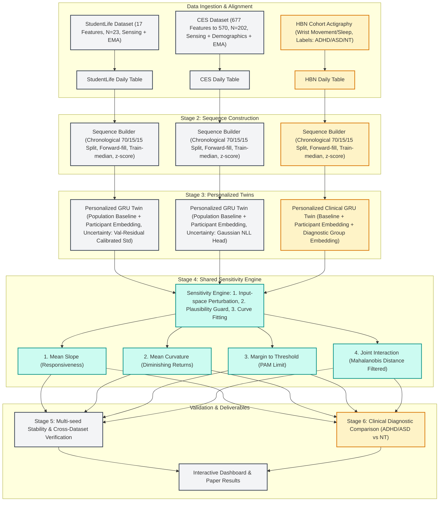
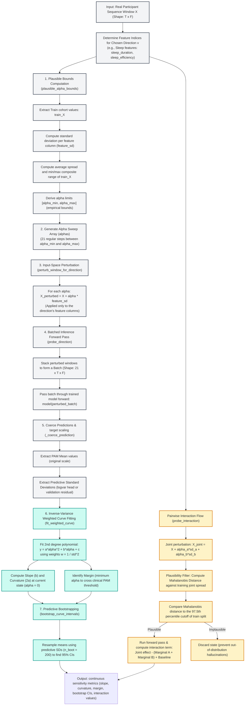

# PersonaTwin: Methodology & Presentation Guide
*A comprehensive guide for explaining the PersonaTwin research project, from foundational pipeline stages to advanced sensitivity-profiling and clinical diagnostic adaptations.*

---

## 1. Executive Summary & Thesis
**PersonaTwin** is a personalized digital twin framework that models individual mental-state dynamics using multimodal behavioral sensing data. 

* **The Core Problem**: Traditional mental health tracking relies on population averages or simple point-in-time predictions. They fail to explain *how* a specific individual's mental state changes in response to behavioral changes, or *how much* behavior change is needed to see an effect.
* **The Core Solution**: We build personalized, uncertainty-aware deep learning twins (GRUs). We then query these twins using a **Sensitivity Engine** that perturbs real input behaviors (in real-world units like hours of sleep or screen time) to map a continuous sensitivity profile (slope, curvature, and margin) for each individual.
* **Unified Scope**: The project combines daily passive sensing datasets (CES and StudentLife) with clinical diagnostics (Healthy Brain Network's ADHD/ASD actigraphy cohort) to evaluate whether these sensitivity profiles differ across neurodivergent populations using a shared analytical engine.

---

## 2. Unified Methodology Flowchart
This chart integrates all aspects of the project, highlighting how the general-population branch and the clinical ADHD/ASD branch merge into the same shared Sensitivity Engine, proving it is a single unified methodology.

---

## 3. Stage-by-Stage Methodology (Basic to Advanced)

### Stage 1: Data Preprocessing & Alignment
* **Basic Level**: We load raw sensor streams (GPS, screen lock/unlock, Bluetooth, accelerometer) and daily surveys (EMA) from participants. We align them so each row represents one participant-day of data.
* **Advanced Level**:
  * **StudentLife**: Low-resource dataset. We process raw database entries, align daily timestamps, and yield 17 features.
  * **CES (College Experience Study)**: High-dimensional dataset. We drop features with extreme missingness and near-zero variance, narrowing down from 677 to 570 features (demographics, passive phone sensing, EMA).
  * **HBN (Healthy Brain Network)**: The clinical cohort. Focuses on wrist actigraphy (movement, sleep duration, onset, wake-after-onset, activity counts). It has no phone-sensing data, which requires a custom, sleep-and-movement-focused feature schema.

### Stage 2: Leakage-Safe Sequence Construction
* **Basic Level**: Models must not cheat. We split data chronologically so that the model only predicts the future based on past behavior. We construct rolling 7-day windows to predict the next day's PAM (Photographic Affect Meter, representing affect/arousal).
* **Advanced Level**:
  * **Temporal Split**: Chronological 70% Train, 15% Validation, 15% Test per participant.
  * **Imputation Protocol**: To prevent data leakage:
    1. Forward-fill missing values (assuming behavior carries over).
    2. Fill remaining gaps with the **training split median** (never using validation/testing statistics).
    3. Z-score normalize features using **mean and standard deviation computed solely from the training data**.
  * **Sequence Dimensions**:
    * StudentLife: 1458 training, 88 validation, and 59 test windows (17 features).
    * CES: 25576 training, 4112 validation, and 3599 test windows (570 features).

### Stage 3: Personalized Temporal Modeling (The Digital Twin)
* **Basic Level**: A standard model learns the "average student." But everyone is different—six hours of sleep makes one person energetic and another exhausted. We train a deep recurrent network (GRU) that adapts to each participant.
* **Advanced Level**:
  * **Adapter Layer**: We inject a learned **participant embedding** (a latent representation vector unique to each person) into the GRU. The embedding shifts the network's internal representations, customizing predictions.
  * **ADHD/ASD Customization (HBN Branch)**: For the HBN cohort, we add a **diagnostic-group embedding** (ADHD, ASD, Neurotypical) alongside the individual participant embedding. This lets the network explicitly capture structural, diagnostic-level behavioral differences.
  * **Predictive Uncertainty**:
    * **CES (Uncertainty-Native)**: The GRU outputs both a mean $\hat{y}$ and a variance $\sigma^2$ (predictive uncertainty), trained using a Gaussian Negative Log-Likelihood (NLL) loss.
    * **StudentLife (Validation-Calibrated)**: The native uncertainty head harmed StudentLife's mean prediction error due to data scarcity. We fall back to a deterministic personalized GRU and calculate uncertainty using validation residual standard deviation.

### Stage 4: Shared Sensitivity Engine (Core Research Novelty)
* **Basic Level**: Instead of just predicting tomorrow's mood, we ask "What if this person slept 1 hour more? What if they walked 2 miles more?" We run these hypothetical scenarios through the trained model to construct a response curve.
* **Advanced Level**:
  * **Input-Space Perturbation (The Stage 4 Fix)**: Historically, models shifted internal representations ($z$). We corrected this to perturb the **actual input behaviors ($x$)** in physical units (e.g. adding hours of sleep), then passed them through the model. This preserves interpretability.
  * **Behavioral Directions**: Features are grouped into 5 domains: Sleep, Activity, Social, Mobility, and Screen.
  * **Empirical Plausibility Guard**: To prevent the engine from simulating impossible behaviors (e.g., 30 hours of screen time), shifts ($\alpha$) are restricted to the empirical min/max values observed in the training cohort.
  * **Curve Fitting & Metric Extraction**: We sweep $\alpha$ over 21 steps, run them through the twin, and fit an uncertainty-weighted quadratic curve ($y = a\alpha^2 + b\alpha + c$) using the inverse predictive variance. From this, we extract:
    1. **Slope**: Current responsiveness (first derivative at $\alpha=0$).
    2. **Curvature**: Acceleration/diminishing returns (second derivative).
    3. **Margin**: The minimum shift required to cross a clinical PAM threshold (e.g., target 8.0 for CES, 12.5 for StudentLife).
  * **Pairwise Interactions**: We perturb two directions simultaneously and compare the output to the sum of individual shifts. We filter out implausible joint states using a Mahalanobis distance cutoff (97.5th percentile of the training distribution) and construct participant-clustered bootstrap confidence intervals (CIs).

---

## 4. Key Differences & Shared Infrastructure
Use this table to prove that the codebase is highly generalizable and modular.

| Component / Stage | Shared Pipeline Code? | How Datasets Differ |
|---|---|---|
| **Preprocessing & Schema** | No (dataset-specific scripts) | StudentLife: 17 features. CES: 570 features. HBN: Actigraphy movement/sleep features only. |
| **Sequence Building** | **Yes (shared framework)** | Splits and chronological boundaries are identical; input/output dimensions adjust dynamically. |
| **Adapter Layer** | **Yes (shared GRU model structure)**| CES & StudentLife: Participant embedding only. HBN: Diagnostic-group embedding + participant embedding. |
| **Uncertainty Method** | No (configuration-driven) | CES: Learned Gaussian NLL head (uncertainty-native). StudentLife: Validation residual standard deviation (deterministic hybrid). |
| **Sensitivity Engine** | **Yes (identical shared code)** | Same mathematical curve fitting, slope, curvature, margin, and bootstrap engine. |

---

## 5. Concrete Numbers Ready for Presentation
If your professor asks for proof of rigor or specific figures, refer to this table:

### Model Performance & Uncertainty
* **Personalization Lift (RMSE improvement over population model)**:
  * **StudentLife**: +5.2% improvement.
  * **CES**: +1.7% improvement.
* **Uncertainty Calibration (95% Nominal Target vs. Observed Coverage)**:
  * **CES**: 96.6% observed coverage (Native Gaussian head works exceptionally well).
  * **StudentLife**: 89.8% observed coverage (Pre-sensitivity audit labels this as *preliminary*).

### Sensitivity Engine Results (Mean Slopes)
* **CES (Primary, 3,599 test windows, N=202)**:
  * *Activity*: $+0.5656$ [95% CI: $0.5039, 0.6233$] (Increased activity corresponds to higher PAM scores).
  * *Mobility*: $+0.1632$ [95% CI: $0.1308, 0.1944$].
  * *Screen Time*: $-0.4781$ [95% CI: $-0.5001, -0.4567$] (Screen time is associated with lower predicted PAM scores).
  * *Sleep*: $-0.0622$ [95% CI: $-0.0677, -0.0561$].
  * *Social*: N/A (CES has no social features mapped).
* **StudentLife (Preliminary, 59 test windows, N=23)**:
  * *Screen Time*: $+0.3220$ [95% CI: $0.3060, 0.3374$].
  * *Sleep*: $+0.1016$ [95% CI: $0.0941, 0.1106$].
  * *Social*: $+0.0824$ [95% CI: $0.0673, 0.1003$].
  * *Activity*: $+0.0449$ [95% CI: $0.0342, 0.0542$].
  * *Mobility*: $-0.2786$ [95% CI: $-0.2933, -0.2677$].

> [!NOTE]
> Slope differences (e.g. screen time slope is negative in CES but positive in StudentLife) show that behavioral categories are dataset-specific operationalizations (CES screen time uses unlock duration; StudentLife uses phone lock). This validates why personalized, dataset-specific modeling is critical.

---

## 6. How to Defend Your Methodology (Talking Points)

### 1. Defending "Model Sensitivity vs. Causal Inference"
> **Professor's Question**: "How can you recommend a behavior change if this isn't a causal model?"
>
> **Your Answer**: *"We are very explicit: this is **model sensitivity**, not a causal effect estimation. We are testing how the trained network’s prediction shifts under counterfactual inputs. This indicates what behavioral levers the model relies on for its predictions. It is an explanatory tool (similar to Individual Conditional Expectation in static models, but extended to dynamic time series), not a medical prescription."*

### 2. Defending the StudentLife Uncertainty Calibration
> **Professor's Question**: "Why is the StudentLife coverage only 89.8% instead of the target 95%?"
>
> **Your Answer**: *"Because StudentLife is a much smaller dataset (59 test windows compared to CES's 3,599), the uncertainty head suffered from high variance and degraded the mean prediction. We chose to prioritize mean prediction accuracy by using a deterministic personalized model, and then calibrated its uncertainty using validation residuals. We label these StudentLife uncertainty results as 'preliminary' and use CES as our primary validation."*

### 3. Defending the ADHD/ASD HBN Extension
> **Professor's Question**: "Why do you have a different branch for ADHD/ASD?"
>
> **Your Answer**: *"The HBN dataset lets us test if our sensitivity engine can detect cohort-level patterns in clinical populations. Because HBN contains actigraphy data, it uses a narrower feature set (sleep and movement). By injecting a diagnostic-group embedding (ADHD vs ASD vs Neurotypical), the digital twin learns structural differences in sleep/activity patterns. The core sensitivity engine runs identically on this cohort, showing how these diagnostic groups respond differently to behavioral levers."*

### 4. Defending the "Stage 4 Correction"
> **Professor's Question**: "Why did you change the sensitivity engine from latent-space to input-space perturbation?"
>
> **Your Answer**: *"Perturbing the latent vector $z$ directly is mathematically easy, but the resulting changes have no real-world units (e.g. shifting $z$ by +0.5 has no physical meaning). By shifting the raw behavioral inputs $x$ (e.g. adding 1 hour to sleep) and re-running the model forward, the entire sensitivity landscape stays in real, clinical units that users and clinicians can interpret."*

---

## 7. Stage 4 Magnified Flowchart: The Sensitivity Engine
This magnified diagram shows the exact execution logic of `src/sensitivity.py` for a single behavioral direction (e.g. Sleep) on a participant sequence.

### Explanatory Breakdown of the Stage 4 Flow (What to say to your Teacher)

You should explain these steps to your teacher to show the engineering rigor and scientific novelty:

1. **Step 1: Plausible Bounds Computation (`plausible_alpha_bounds`)**
   * *What it means:* We determine the maximum and minimum behavior shifts that are realistic for this direction.
   * *Why it's important:* If we perturb a feature by a random high amount (e.g. telling the model the participant slept 30 hours in a day), the model will predict on "impossible" out-of-distribution data, leading to garbage predictions. We calculate the actual training min/max composite range for these features, ensuring all simulated shifts are empirically grounded.

2. **Step 2: Generate Alpha Sweep Array (`default_direction_alphas`)**
   * *What it means:* We create a continuous range of 21 test points (shifts) stretching from the lowest plausible change to the highest plausible change (e.g. from $-2.5$ standard deviations to $+2.5$ standard deviations).
   * *Why it's important:* Instead of testing a single discrete "what-if" scenario, we evaluate the behavior change across a smooth, continuous spectrum.

3. **Step 3: Input-Space Perturbation (`perturb_window_for_direction`)**
   * *What it means:* We modify the **raw features** directly (like raw sleep hours) before passing them to the model, rather than modifying the model's internal hidden representations ($z$).
   * *Why it's important:* Shifting internal layers has no real-world interpretation. By shifting raw inputs and passing them through the entire model, our results are reported in real physical units (like "an extra hour of sleep increases mood by $X$ points"), which is clinically and practically interpretable.

4. **Step 4: Batched Inference Forward Pass (`probe_direction`)**
   * *What it means:* We clone the user's 7-day behavior window 21 times, apply the 21 different alpha shifts, stack them into a single tensor batch, and run them forward through the personalized GRU model.
   * *Why it's important:* Running 21 separate model passes would be computationally slow. Batching them takes advantage of modern GPU/CPU acceleration, enabling real-time sensitivity analysis.

5. **Step 5: Coerce Predictions & Target Scaling (`_coerce_prediction`)**
   * *What it means:* The model outputs predictions in standardized values (z-scores). We use the training split's mean and standard deviation to convert these predictions back into original units (e.g. original PAM scale).
   * *Why it's important:* It ensures the output metrics correspond directly to standard clinical scale numbers that clinicians understand.

6. **Step 6: Inverse-Variance Weighted Curve Fitting (`fit_weighted_curve`)**
   * *What it means:* We fit a quadratic curve ($y = a\alpha^2 + b\alpha + c$) across the 21 prediction points. Crucially, each point is weighted by the inverse of its predictive variance ($w = 1/\sigma^2$).
   * *Why it's important (The Core Novelty):* If the model is highly uncertain about a simulated behavioral shift, that prediction point receives less weight in the curve fit. From this fitted curve, we calculate:
     * **Slope ($b$):** The participant's immediate mood responsiveness near their current behavioral baseline.
     * **Curvature ($2a$):** The rate of acceleration or diminishing returns (e.g., does extra sleep help less and less as it increases?).
     * **Margin:** The exact amount of behavior shift needed to cross a target clinical threshold.

7. **Step 7: Predictive Bootstrapping (`bootstrap_curve_intervals`)**
   * *What it means:* We resample the predictions using the model's own predicted standard deviation 200 times and recalculate the curves to establish 95% Confidence Intervals (CIs) for our slope and curvature.
   * *Why it's important:* It tells us if the calculated sensitivity curves are statistically reliable or just random noise.

8. **Pairwise Interaction Flow & Mahalanobis Filter (`probe_interaction`)**
   * *What it means:* We simulate shifting two behaviors simultaneously (e.g. changing both sleep and screen time). To make sure the joint behavior is realistic, we calculate the Mahalanobis distance against the joint training distribution and discard simulated states that fall outside the 97.5% boundary.
   * *Why it's important:* This ensures the model does not hallucinate under impossible joint conditions (e.g., a person sleeping 12 hours *and* spending 16 hours on their screen on the same day). It calculates whether the joint behavioral shift is more (or less) than the simple sum of individual changes (identifying synergetic or buffering behavioral interactions).

