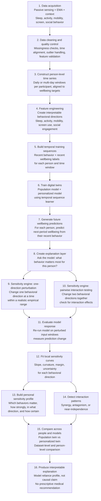

# PersonaTwin:  Research Flowchart

## The problem we are solving

Most wellbeing prediction systems stop after answering:

> "What wellbeing score is likely tomorrow?"

They do not explain which behavioral patterns the model is relying on, whether those patterns differ between people, or how the prediction would respond to a realistic change in behavior.

PersonaTwin addresses this missing explanation layer.

## Flowchart (Detailed view)

## Detailed Sensitivity Engine flowchart (core novelty)

```mermaid
flowchart TD
    A[Real participant input window X\nT time steps x F behavioral features] --> B[Select behavioral direction v\nExample: sleep, activity, mobility, screen, social]
    B --> C[Map v to relevant feature columns\nSleep features, activity features, etc.]
    C --> D[Estimate empirical perturbation bounds\nUse training cohort spread and observed range for realistic shifts]
    D --> E[Generate alpha sweep\nMany small increases/decreases around current behavior\nAll within plausible bounds]

    E --> F[Create perturbed windows\nFor each alpha, adjust only the chosen direction's features\nX' = X + alpha * feature_sd]
    F --> G[Batch forward pass through trained twin\nEvaluate model on all perturbed windows at once]
    G --> H[Convert predictions to original scale\nRestore target-scale interpretation and quantify predictive uncertainty]
    H --> I[Fit local sensitivity curve\nQuadratic or smooth response around alpha = 0\nWeighted by inverse predictive variance]

    I --> J[Compute sensitivity diagnostics\nSlope = local responsiveness\nCurvature = accelerating or diminishing change\nMargin = amount needed to cross a chosen reference level]
    J --> K[Bootstrap uncertainty intervals\nAssess robustness of slope, curvature, and margin]
    K --> L[Store per-person, per-direction profile\nDirection-specific behavioral sensitivity]

    B --> M[Pairwise interaction analysis\nPerturb two directions together]
    M --> N[Construct joint perturbation\nX_joint = X + alpha_a * sd_a + alpha_b * sd_b]
    N --> O[Check plausibility guard\nReject implausible combinations outside observed training distribution]
    O --> P[Run joint forward pass\nCompare joint prediction with additive single-direction expectations]
    P --> Q[Compute interaction term\nJoint effect - marginal A - marginal B + baseline]
    Q --> R[Classify effect\nSynergy, antagonism, or largely independent behavior]

    L --> S[Aggregate across people\nPopulation-level vs personalized sensitivity patterns]
    R --> S
    S --> T[Paper-ready novelty claim\nThe twin is not only predictive; it is queryable\nIt reveals which behaviors drive the model's prediction for each person]
    T --> U[Interpretation statement\nThis is model sensitivity, not causal proof or clinical prescription]
```

## Why this is the novel contribution

This is the part that makes the project scientifically distinctive:

1. The model is not just predictive; it is interrogated in input space.
2. We perturb real behavioral variables, not hidden latent states, so the explanation stays meaningful.
3. The result is a person-specific sensitivity profile that shows how the twin responds to realistic changes in sleep, activity, mobility, screen use, or social behavior.
4. We also test whether the combined effect of two behaviors is more than the sum of their individual effects.
5. The method produces an interpretable, uncertainty-aware behavioral explanation for each person, while remaining explicit that it is model sensitivity rather than causation.

## What is novel

The novelty is the combination of three capabilities:

1. **A behavioral twin for each person**

   The system learns a person's temporal relationship between behavior and wellbeing instead of relying only on a population average.

2. **An input-space sensitivity engine**

   We can ask the trained twin what would happen if a person's behavioral pattern were slightly higher or lower. The change is made to recognizable behavioral inputs, such as sleep or activity, rather than to an unexplained internal representation.

3. **Personalized explanation of model reliance**

   The result is not only a predicted score. It is a profile showing which behavioral directions the model uses most strongly for that person, whether the response is linear or curved, and how certain the estimate is.

## How to explain the Sensitivity Engine

Use this example:

> We take one person's recent behavioral window and ask the trained model three questions: what does it predict with the observed behavior, what does it predict if activity is somewhat lower, and what does it predict if activity is somewhat higher? The difference between those predictions tells us how sensitive that person's model-based wellbeing estimate is to activity.

The same test can be applied to sleep, mobility, screen use, and available social signals.

The engine can also ask:

> Does changing sleep and screen use together produce an additional effect that is not visible when looking at each behavior separately?

That additional effect is called an interaction. It may indicate synergy, antagonism, or no meaningful combined effect.

## What the numeric outputs mean

| Output | Plain-language meaning |
|---|---|
| Slope | How strongly the prediction responds near the person's current behavior |
| Curvature | Whether the response changes as the behavioral shift becomes larger |
| Margin | How large a modeled shift is needed to reach a chosen reference level, if reached |
| Confidence interval | How uncertain the estimated sensitivity is |
| Interaction | The extra combined effect of changing two directions together |

## What the CES results show

The CES results show that:

- activity is the strongest behavioral direction used by the population model;
- the personalized model changes the sensitivity profile for individuals;
- pairwise effects are mostly very small;
- therefore, the current CES model relies more on individual behavioral directions than on strong behavioral combinations.

This is still a useful finding. It tells us that the model's explanation is mainly marginal and person-specific rather than interaction-driven for this dataset and checkpoint.

## What the project does not claim

PersonaTwin reports **model sensitivity**, not proof that changing a behavior will cause a wellbeing change.

It does not provide a medical diagnosis or an automatic intervention recommendation. It explains what the trained model relies on and creates a basis for future validation with larger samples and clinical datasets.

## Summed Up version

> PersonaTwin is a personalized wellbeing modeling system. It learns a person's behavioral pattern from time-series data and creates a digital twin that predicts their future wellbeing. Our main contribution is a sensitivity engine that lets us query this twin: we change realistic behavioral inputs such as activity or sleep and observe how the predicted wellbeing changes. This converts a prediction model into an interpretable, person-specific behavioral profile. We also test whether two behaviors interact, although the current CES checkpoint shows that most effects are individual rather than strongly combined. The system is designed as a model-explanation and hypothesis-generation tool, not as a causal or clinical prescription system.